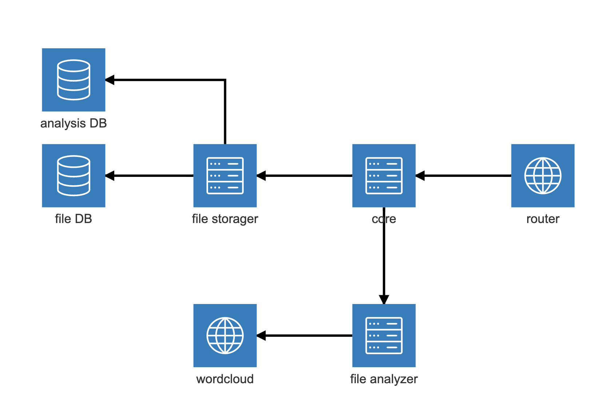

# КР 2 КПО

## Анализатор текстовых файлов на английском языке

### Функционал API

API имеет функции:

- загружать файл в базу данных
- получать файл из базы данных
- анализировать файл
- получать облако слов по файлу
- сравнивать файлы между собой по результатам их анализа

### Архитектура

Все запросы приходят на `api-router`. Там делается предпроверка на их корректность и в случае успеха происходит перенаправление запросов на `core-service`.
В `core-service` реализована вся бизнес логика. Для получения файлов этот сервис обращается в `file-storager-service`. В `file-storager-service` происходит вся работа с базами данных - сохранение и получение информации. В базах данных хранятся данные об айдишниках, хешах файлов. А также результаты анализа файлов, сами файлы и картинки облака слов.
`file-analyzer-service` реализует логику, связанную с работой с содержимым файлов - анализ и получение облака слов.

#### Базы данных

В API используются две базы данных.

1. Образ `PostgreSQL` для хранения структурированных данных - результатов анализа файлов и хэшей + айдишников файлов.
2. Образ `Mongo DB` для хранения содержимого файлов и облаков слов, получаемых по этим файлам.

##### Postgre

###### Устройство таблицы хешей

$
\begin{array}{|c|c|}
    \hline
    \text{id} & \text{integer}\ \bold{PK} \\
    \hline
    \text{hash} & \text{string} \\
    \hline
\end{array}
$

###### Устройство таблицы анализа

$
\begin{array}{|c|c|}
    \hline
    \text{id} & \text{integer}\ \bold{PK} \\
    \hline
    \text{paragraphs amount} & \text{integer} \\
    \hline
    \text{sentences amount} & \text{integer} \\
    \hline
    \text{words amount} & \text{integer} \\
    \hline
    \text{symbols amount} & \text{integer} \\
    \hline
    \text{average sentences per paragraph} & \text{float} \\
    \hline
    \text{average words per sentence} & \text{float} \\
    \hline
    \text{average length of words} & \text{float} \\
    \hline
\end{array}
$

##### Mongo

Есть 2 таблицы:

1. Таблица файлов - хранит в себе файлы по их айдишникам
2. Таблица облаков слов - хранит облака слов по их айдишникам

### Документация

Для каждого сервиса есть `Swagger` документация (*Предварительно нужно запустить сервисы в докере*). Она доступна по адресам:

- [http://localhost:8080/swagger/](http://localhost:8080/swagger/) — для `api-router`
- [http://localhost:8081/swagger/](http://localhost:8081/swagger/) — для `core-service`
- [http://localhost:8082/swagger/](http://localhost:8082/swagger/) — для `file-storager-service`
- [http://localhost:8083/swagger/](http://localhost:8083/swagger/) — для `file-analyzer-service`
